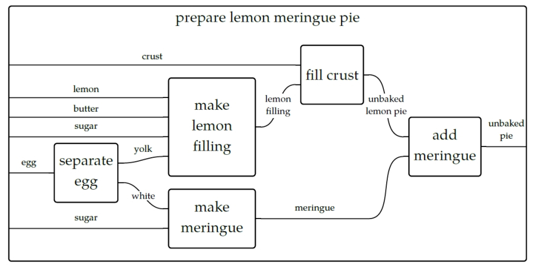
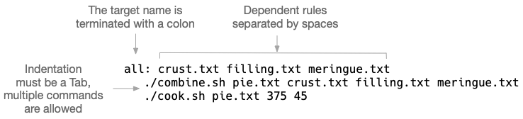
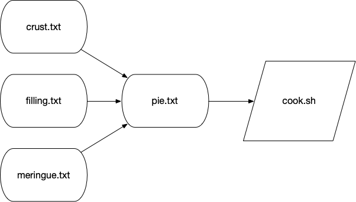

= Reproducible commands and workflows with `make`

The GNU `make` program was created in 1976 to help build executable programs from source code files.
While it was originally developed to assist with programming in the `c` language, it is not limited to that language or even to the task of compiling code.
According to the manual, one "can use it to describe any task where some files must be updated automatically from others whenever the others change."
The `make` program has gone far beyond it's role as a build tool to become a workflow system.

== Makefiles are recipes

When you run the `make` command, it looks for a file called `Makefile` (or `makefile`) in the current working directory.
This file contains recipes that describe discrete actions that combine to create some output.
Think of how a recipe for a lemon pie has steps that need to be completed in a particular order and combination.
For instance, we need to separately create the crust, filling, and meringue and then put them together and bake them before we can enjoy our tasty treat.
We can visualize this with something called a "string diagram" like below.

.A string diagram describing how to make a pie. From Brendan Fong and David Spivak, Seven Sketches in Compositionality: An Invitation to Applied Category Theory.

It's not really important if you make the pie crust the day before and keep it chilled, and the same might hold true for the filling, but it's certainly true that the crust needs to go into the dish followed by the filling and finally the meringue.
An actual recipe might refer to a generic recipes for the crust and meringue in parts of the book and list the steps just for the lemon filling and baking instructions.

We can write a `Makefile` to mock up these ideas.
We'll use shell scripts to pretend we're assembling the various ingredients into some output like `crust.txt` and `filling.txt`.
For instance, I've written a `combine.sh` script that expects a file name and a list of "ingredients" to put into the file:

----
$ ./combine.sh
usage: combine.sh FILE ingredients
----

I can pretend to make the "crust" like this:

----
$ ./combine.sh crust.txt flour butter water
----

There is now a `crust.txt` file with the following contents:

----
$ cat crust.txt
Will combine flour butter water
----

It's common for a recipe in a `Makefile` to create an output file such as this, but it's not necessary.
Note in this example from the `pie` directory that the `clean` target actually removes files rather than making them:

----
all: crust.txt filling.txt meringue.txt <1>
	./combine.sh pie.txt crust.txt filling.txt meringue.txt <2>
	./cook.sh pie.txt 375 45

filling.txt:                            <3>
	./combine.sh filling.txt lemon butter sugar

meringue.txt:                           <4>
	./combine.sh meringue.txt eggwhites sugar

crust.txt:                              <5>
	./combine.sh crust.txt flour butter water

clean:                                  <6>
	rm -f crust.txt meringue.txt filling.txt
----

<1> This defines a target called `all`. The first target will be the one run when no target is specified. Convention holds that the `all` target will run _all_ the targets necessary to accomplish some default goal like building a piece of software. Here we want to create the `pie.txt` file from the component files and "cook" it. The name `all` is not as important as it being defined first. The target name is followed by a colon and then any dependencies that must be satisfied before running this target.
<2> The `all` target has two commands to run. Each command is indented with a `Tab` character.
<3> This is the `filling.txt` target. The goal of this target is to create the file called "filling.txt". It's common but not necessary to use the output file name as the target name. This target has just one command which is to combine the ingredients for the filling.
<4> This is the `meringue.txt` target, and it combines the egg whites and sugar.
<5> This is the `crust.txt` target that combines flour, butter, and water.
<6> It's common to have a `clean` target to remove any files that were created in the normal course of building.

As you can see above, the target (also sometimes called a "rule") has a name followed by a colon.
Any dependent actions can be listed after the colon in the order you wish them to be run.
The actions for a target must be indented with a `Tab` character, and you are allowed to define as many commands as you like.

== Running a specific target

Each recipe in a `Makefile` is called a "target," "rule," or "recipe." 
The order of the targets is not important beyond the first target being the default. 
Targets can reference other targets defined earlier or later in the file.

To run a specific target, we can run `make <target>` to have `make` run the commands for a given recipe:

----
$ make filling.txt
./combine.sh filling.txt lemon butter sugar
----

And now there is a file called `filling.txt`:

----
$ cat filling.txt
Will combine lemon butter sugar
----

If we try to run this target again, we'll be told there's nothing to do because the file already exists:

----
$ make filling.txt
make: `filling.txt' is up to date.
----

One of the reasons for the existence of `make` is precisely not to do extra work to create files unless some underlying source has changed.
In the course of building software or running a pipeline, it may not be necessary to generate some output unless the inputs have changed (such as the source code being modified).

To force `make` to run the `filling.txt` target, we can either remove that file or run `make clean` to remove any of the files that have been created:

----
$ make clean
rm -f crust.txt meringue.txt filling.txt pie.txt
----

== Running with no target

If you run the `make` command with no arguments, and it will automatically run the first target.
This is the main reason to place the `all` target (or something like it) first.
Be careful not to put something destructive like a `clean` target first as you might end up accidentally running it and removing valuable data!

Let's run `make` with the above `Makefile` and see the output:

----
$ make                                                  <1>
./combine.sh crust.txt flour butter water               <2>
./combine.sh filling.txt lemon butter sugar             <3>
./combine.sh meringue.txt eggwhites sugar               <4>
./combine.sh pie.txt crust.txt filling.txt meringue.txt <5>
./cook.sh pie.txt 375 45                                <6>
Will cook "pie.txt" at 375 degrees for 45 minutes.
----

<1> We run `make` with no arguments. It looks for the first target in a file called `Makefile` in the current working directory.
<2> The `crust.txt` recipe is being run first. Because we didn't specify a target, `make` runs the `all` target which is defined first, and this target lists the `crust.txt` as it's first dependency.
<3> Next the `filling.txt` target is run.
<4> Followed by the `meringue.txt`.
<5> Next we assemble `pie.txt`.
<6> And then we "cook" the pie at 375 degrees for 45 minutes.

If you run `make` again, you'll see the intermediate steps to produce the `crust.txt`, `filling.txt`, and `meringue.txt` files are skipped because those files already exist:

----
$ make
./combine.sh pie.txt crust.txt filling.txt meringue.txt
./cook.sh pie.txt 375 45
Will cook "pie.txt" at 375 degrees for 45 minutes.
----

If you want to force them to be recreated, you can run `make clean && make`:

----
$ make clean && make
rm -f crust.txt meringue.txt filling.txt pie.txt
./combine.sh crust.txt flour butter water
./combine.sh filling.txt lemon butter sugar
./combine.sh meringue.txt eggwhites sugar
./combine.sh pie.txt crust.txt filling.txt meringue.txt
./cook.sh pie.txt 375 45
Will cook "pie.txt" at 375 degrees for 45 minutes.
----

== Makefiles create DAGs

Each target can specify other targets as prerequisites or dependencies that must be accomplished first.
These actions create a graph structure where there is some starting point and paths through targets to finally create some output file(s).
The path described for any target should be a _directed_ (from a start to a stop) _acyclic_ (having no cycles or infinite loops) _graph_ or a DAG:

.The targets may join together to describe a directed acyclic graph (DAG) of actions to produce some result.

Many analysis pipelines are just that -- a graph of some input like a FASTA sequence file and some transformations (trimming, filtering, comparisons) into some output (e.g., BLAST hits, gene predictions, functional annotations).
You would be surprised at just how far `make` can be abused to document your work and even create fully functional analysis pipelines!

== Using `make` to compile a `c` program

I believe it helps to use `make` for its intended purpose at least once in your life in order to really understand why it exists.
Let's take a moment to write and compile a "Hello, World" example in the `c` language.

In the `c-hello` directory, you will find a simple `c` program that will print "Hello, World!".
Here is the `hello.c` source code:

----
#include <stdio.h>            <1>
int main() {                  <2>
   printf("Hello, World!\n"); <3>
   return 0;                  <4>
}                             <5>
----

Let's take a moment to learn just enough `c` to be dangerous going line-by-line:

<1> Like `bash`, the `#` character introduces comments in the `c` language, but this is a special comment that allows external modules of code to be used. Here, we want to use the `printf` (print-format that we saw in the previous chapter), so we need to `include` the standard I/O (input/output) module called `stdio`. We actually only need to include the "header" file, `stdio.h`, to get at the function definitions in that module. This is a standard module, and the `c` compiler will look in various locations for any included files to find it. There may come times when you are unable to compile `c` (or `c++` programs) from source code because some header file cannot be found. For example, the `gzip` library is often used to de/compress data, but it is not always installed in a libary form that other programs may `include` in this way. Therefore you will have to download and install the `libgz` program, being sure to install the headers into the proper `include` directories. Note that package managers like `apt-get` and `yum` often have `-dev` or `-devel` packages that you have to install to get these headers, e.g., you would install both `libgz` and `libgz-dev` or whatnot.
<2> This is the start of a function declaration in `c`. The `int` (an "integer") is the return value of the function called `main()`. The parentheses `()` list the parameters to the function. There are none, so the the parens are empty. The opening curly brace `{` shows the start of the code that belongs to the function. Note that `c` will automatically execute the `main()` function, and every `c` program must have a `main()` function where the program starts.
<3> The `printf()` function will print the given string to the command line. This function is defined in the `stdio` library, which is why we need to `#include` the header file above.
<4> `return` will exit the function and return the value `0`. Since this is the return value for the `main()` function, this will be the exit value for the entire program. The value `0` indicates that the program ran normally -- think "zero errors." Any non-zero value would indicate a failure. 
<5> This curly brace `}` is the closing mate for the one on line 2 and marks the end of the `main()` function. 

To turn that into an executable program you will need to have a `c` compiler on your machine.
We can use the `gcc` (GNU c compiler) with this command:

----
$ gcc hello.o
----

That will create a file called `a.out` which is an executable file. 
On my Mac, this is what `file` will report:

----
$ file a.out
a.out: Mach-O 64-bit executable x86_64
----

And I can execute that:

----
$ ./a.out
Hello, World!
----

I don't like the name `a.out`, though, so I can use the `-o` option to name the output file called `hello`:

----
$ gcc -o hello hello.c
----

Run the resulting `hello` executable.
You should see the same output.

Rather than typing `gcc -o hello hello.c` every time I modify the `hello.c`, I can put that as a "target" into a `Makefile`:

----
hello:
	gcc -o hello hello.c
----

And now I can type `make hello` or just `make` if this is the first target:

----
$ make
gcc -o hello hello.c
----

If I run `make` again, nothing happens because the `hello.c` file hasn't changed:

----
$ make
make: `hello' is up to date.
----

Alter your `hello.c` file to print "Hola" instead of "Hello," and then try running `make` again:

----
$ make
make: `hello' is up to date.
----

We can force make to run the targets using the `-B` option:

----
$ make -B
gcc -o hello hello.c
----

And now our new program has been compiled:

----
$ ./hello
Hola, World!
----

This is clearly a trivial example, and you may be wondering how this is actually a time saver.
A real-world project in `c` or any language would likely have multiple `.c` files with headers (`.h` files) describing their functions so that they could be used by other `.c` files.
The `c` compiler would need to turn each `.c` file into `.o` ("out") files and then link them together into a single executable.
Imagine you have dozens of `.c` files, and you change one line of code in one file.
Do you want to type dozens of commands to recompile and link all your code?
Of course not!
You would build a tool to automate those actions for you.

We can add targets to the `Makefile` that don't generate new files.
It's common to have a `clean` target that will clean up files and directories that we no longer need.
Here I can create `clean` target to remove the `hello` executable.

----
clean:
	rm -f hello
----

If I want to be sure that the exeuctable is removed before every running the `hello` target, I can add it as a dependency:

----
hello: clean
	gcc -o hello hello.c
----

It's good form to document for `make` that this is a "phony" target because the result of the target is not a new file to "make."
We use the `.PHONY:` target and list all the phonies.
Here is our complete `Makefile` now:

----
$ cat Makefile
.PHONY: clean

hello: clean
	gcc -o hello hello.c

clean:
	rm -f hello
----
 
If you `make` in the `c-hello` directory with this `Makefile`, you should see this:

----
$ make
rm -f hello
gcc -o hello hello.c
----

And there should now be a `hello` executable in your directory that you can run:

----
$ ./hello
Hello, World!
----

Notice that the `clean` target can be listed as a dependency to the `hello` target even _before_ the target itself is mentioned.
`make` will read the entire file and then use the dependencies to resolve the graph.
If you were to put "foo" as an additional dependency to `hello` and then try to running `make` again, you would see this:

----
$ make
make: *** No rule to make target `foo', needed by `hello'.  Stop.
----

When we write `bash` programs, the program is executed from the top to the bottom, each statement one after the other.
The `Makefile` allows us to write independent groups of actions that are ordered by their dependencies.
They are essentially like _functions_ in a higher-level language.
We have essentially written a program who's output is ... a program.

I'd encourage you to `cat hello` to see what the `hello` program "looks" like. 
It's mostly binary information that will look like jibberish, but you will probably be able to make out some plain English, too.
You can also use `strings hello` to extract just the "strings" of text.

== Using `make` for a shortcut

Let's look at how we can abuse Makefiles to create shortcuts for commands.
Here we will say "Hello, World!" on the command line using the `echo` command:

----
.PHONY: hello            <1>

hello:                   <2>
	echo "Hello, World!" <3>
----

<1> Since the `hello` target doesn't actually produce a file, we list it as a "phony" target.
<2> This is the `hello` target. The name of the target should be composed only of letters and numbers, should have no spaces before it, and is followed by a colon (`:`).
<3> The command(s) to run for the `hello` target are listed on lines that are indented with a tab character.

I often use a `Makefile` only to remember how to invoke a command with various arguments.
That is, I might write an analysis pipeline and then document how to run the program on various data sets with all their parameters.
In this way I'm documenting my work in a way that I can immediately reproduce it simply by running the target!

== Defining variables

Here is an example of a `Makefile` I wrote to document how I ran the Centrifuge app for making taxonomic assignments to short reads:

----
INDEX_DIR = /data/centrifuge-indexes         <1>

clean_paired:
    rm -rf $(HOME)/work/data/centrifuge/paired-out

paired: clean_paired                         <2>
    ./run_centrifuge.py \                    <3>
    -q $(HOME)/work/data/centrifuge/paired \ <4>
    -I $(INDEX_DIR) \                        <5>
    -i 'p_compressed+h+v' \
    -x "9606, 32630" \
    -o $(HOME)/work/data/centrifuge/paired-out \
    -T "C/Fe Cycling"
----

<1> Here I define the variable `INDEX_DIR` and assign a value. Note that there must be spaces on either side of the `=`. I prefer ALL_CAPS for my variable names, but this just personal preference.
<2> Run the `clean_paired` target prior to running this target. This ensures that there is no leftover output from a previous run.
<3> This action is long, so I used backslashes `\` as on the command line to indicate the command continues to the next line.
<4> To have `make` use the value of the variable, you deference like `$(VAR)`. Here we can use the environmental variable `$HOME` as the `$(HOME)`.
<5> The `$(INDEX_DIR)` refers to the variable defined at the top.

== Writing a workflow

Following is an example of how to write a workflow as `make` targets.
The goal is to download the yeast genome and characterize various gene types as "Dubious," "Uncharacterized," "Verified," and such.
This is accomplished with a collection of command-line tools such as `wget`, `grep`, and `awk` combined with a custom shell script called `download.sh` all pieced together and run in order by `make`:

----
.PHONY: all fasta features test clean

FEATURES = http://downloads.yeastgenome.org/curation/chromosomal_feature/SGD_features.tab

all: fasta genome chr-count chr-size features gene-count verified-genes uncharacterized-genes gene-types terminated-genes test

clean:
	find . \( -name \*gene\* -o -name chr-\* \) -exec rm {} \;
	rm -rf fasta SGD_features.tab

fasta:
	./download.sh

genome: fasta
	(cd fasta && cat *.fsa > genome.fa)

chr-count: genome
	grep -e '^>' "fasta/genome.fa" | grep 'chromosome' | wc -l > chr-count

chr-size: genome
	grep -ve '^>' "fasta/genome.fa" | wc -c > chr-size

features:
	wget -nc $(FEATURES)

gene-count: features
	cut -f 2 SGD_features.tab | grep ORF | wc -l > gene-count

verified-genes: features
	awk -F"\t" '$$3 == "Verified" {print}' SGD_features.tab | \
		wc -l > verified-genes

uncharacterized-genes: features
	awk -F"\t" '$$2 == "ORF" && $$3 == "Uncharacterized" {print $$2}' \
		SGD_features.tab | wc -l > uncharacterized-genes

gene-types: features
	awk -F"\t" '{print $$3}' SGD_features.tab | sort | uniq -c > gene-types

terminated-genes: 
	grep -o '/G=[^ ]*' palinsreg.txt | cut -d = -f 2 | \
		sort -u > terminated-genes

test:
	pytest -xv ./test.py
----

I won't bother commenting on all the commands.
Mostly I want to demonstrate how far we can abuse a `Makefile` to create a workflow.
Not only have we documented all the steps, but they are _runnable_ with nothing more than the command `make`!
Absent using `make`, we'd have to write a shell script to accomplish this or, more likely, move to a more powerful language like Python.
The resulting program written in either language would probably be longer, buggier, and more difficult to understand.
Sometimes, all you really need is a `Makefile` and some shell commands.

== Other workflow managers

As you bump up against the limitations of `make`, you may choose to move to a workflow manager.
There are literally hundreds to choose from including:

* Snakemake which extends the basic concept `make` with Python.
* The Common Workflow Language (CWL) defines workflows and parameters in a configuration file (in YAML), and you use tools like `cwltool` or `cwl-runner` (both implemented in Python) to execute the workflow with another configuration file that describes the arguments.
* The Workflow Description Language (WDL) takes a similar approach to describing workflows and arguments and can be run with the Cromwell engine.
* Pegasus allows you to use Python code to describe a workflow that then is written to an XML file that is the input for the engine that will run your code.
*  Nextflow is similar in that you use a full programming language called "Groovy" (a subset of Java) to write a workflow that can be run by their engine.

All of these systems have the same basic ideas as `make`, so understanding how `make` works and how to write the pieces of your workflow and how they interact is the basis for any larger analysis workflow you may create.

== Further reading

Here are some other resources you can use to learn about Make:

* Online manual: https://www.gnu.org/software/make/manual/make.html
* _GNU Make Book_ by John Graham-Cumming, No Starch Press, 2015: https://nostarch.com/gnumake
* _Managing Projects with GNU Make_ by Robert Mecklenburg, O'Reilly, 2009: http://shop.oreilly.com/product/9780596006105.do
